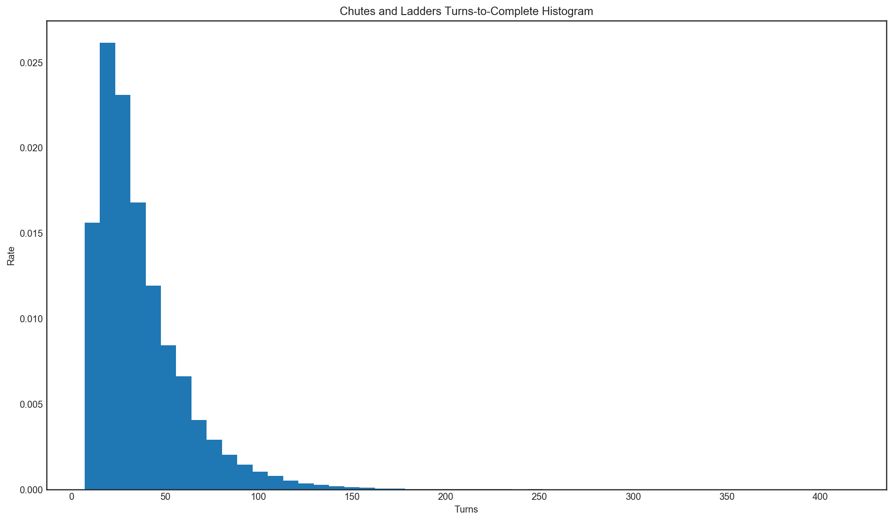

# Chutes and Ladders

Tonight I was playing some Chutes and Ladders with my family and was struck by how bad my luck was. Simultaneously, I was struck by how simple the game is. There is no skill, there are no decisions. So, to see how bad my luck really is I decided to simulate the game and see what my expectations should be!

# Results

Chutes and Ladders was run a million times and summary statistics were gathered from there. The best you can ever do in the game is seven turns, which is surprisingly common, occuring in roughly 3 in 200 games. There are loops in the game, so the maximum number of turns is unbounded. The distribution is not normal, showing strong leftward skew. The worst I've seen in several million simulations is the 415 seen in this run. Having run this simulation many times, the other percentiles and summary statistics are very stable.

|      stat |      value |
| --------: | ---------: |
|     count |    1000000 |
|      mean |      36.68 |
|     stdev |      23.74 |
|      mode |      21.00 |
|     0.0th |       7.00 |
|    25.0th |      20.00 |
|    50.0th |      30.00 |
|    75.0th |      46.00 |
|    99.0th |     121.00 |
|    99.9th |     173.00 |
|   100.0th |     415.00 |

## Fun stuff
* There are three ladder paths you can take to finish the game in 7 moves, listed with their rate of incidence. I love that one of them involves a chute.
   * 9.9%: {roll 1, `1->38`, roll 2x to get 10, `48->26`, roll 2, `28->84`, roll 3x to get 16}
   * 35.2%: {roll 4, `4->14`, roll 3x to get 14, `28->84`, roll 3x to get 16}
   * 54.9%: {roll 1, `1->38`, roll 3x to get 13, `51->67`, roll 4, `71->91`, roll 2x to get 9}
* I tried removing each chute and ladder in turn to see which was the most effective in helping and then hurting the player ([data here](https://docs.google.com/spreadsheets/d/1RPYgSvy_zq4Yt1JwCt_gByxLd3CEd0v-wlqIn1Y2BII/edit#gid=0)):
   * The long ladder from 28->84 is very important to the player, but surprisingly is only the second-most effective in the game. The far shorter 80->100 ladder is roughly 50% more important. I assume this is because it is an automatic win and removes the treacherous top row from the game.
   * The 1->38 ladder only improves mean turn count by 2.3%. It is rarely hit and never hit twice.
   * The 87->24 chute, the longest jump in the game, is unsurprisingly the most vicious. Without that slide the median turn count would be 3 lower and the mean would be a whopping 7 turns lower.
   * The 49->11 slide is more meaningful than the 63->19 slide. I assume this is because there are major ladders closer to 19 than 11, making the hit of going back to 11 harder to recover
   * No chute or ladder individually had any effect on the minimum turn count. Looking at the list from above, there is no single ladder or chute that appears in all the lists.

# Implementation

The chutes and ladders were copied from our copy of the game. The game is modeled as a list of 100 squares which will contain either `None` or a destination square's index. This skips the hashing step in using a dict and since the board is only 100 items it is easy to hold as a list. By assessing those destinations at the start of the turn instead of the end we avoid having to do a bounds check on the board array twice. Bookkeeping aside, the game is literally a 3-line `while` loop.

Summary statistics are calculated using a mix of the built-in `statistics` library and `numpy`. Histogram is calculated using `matplotlib`.

Python on Mac does not like `matplotlib` at all. I got it working using Python 3 without a virtual environment.

# Conclusion

I have never counted my turns in a game of Chutes and Ladders, but I also almost always lose. Unlike Candyland where I routinely palm bad cards, I play Chutes and Ladders to win. And yet, I still lose more than I think I should.